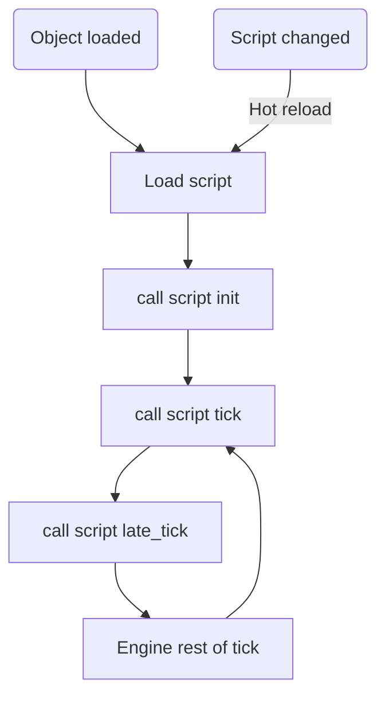

```mermaid
graph TD
    ObjectLoaded[Object loaded]@{ shape: event } --> LoadScript
    ScriptChanged[Script changed]@{ shape: event } --> |Hot reload| LoadScript
    LoadScript[Load script] --> ScriptInit
    ScriptInit[call script init] --> ScriptTick
    ScriptTick[call script tick] --> ScriptLateTick
    ScriptLateTick[call script late_tick] --> Engine
    Engine[Engine rest of tick] --> ScriptTick
```

If any error occurs in the script loading, compilation, or execution, the script will be
disabled and the error will be visible in the debug window.
