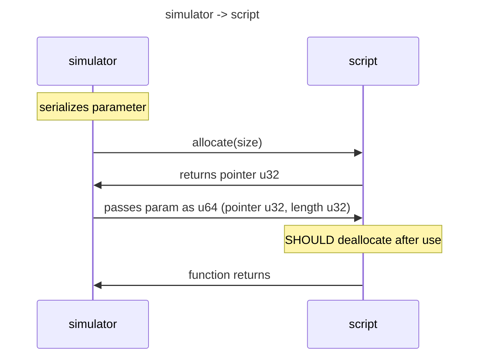
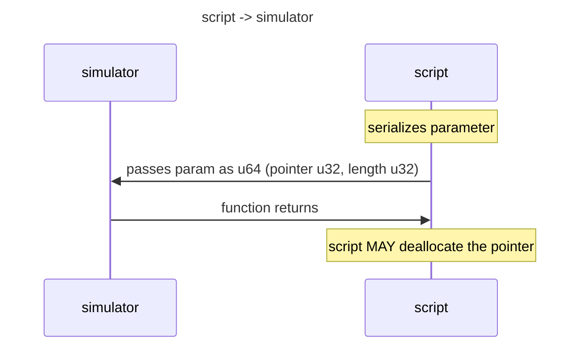

The WASM API is currently semi-stable. A lot is in place and likely to not change or at least
not change much. Until the WASM API is truly stable, the best documentation for it is the
Rust reference implementation. When it is stable, this documentation will be updated.

In general the API provides you some functions you can call to read or manipulate state in
the simulator. You are also expected to provide a few methods that the simulator can call
in your script. See [lotus-script-sys lib.rs](https://github.com/Oriolus-Software/LOTUS-Scripting/blob/master/lotus-script-sys/src/lib.rs)
and [lotus-script script! macro](https://github.com/Oriolus-Software/LOTUS-Scripting/blob/master/lotus-script/src/macros.rs)
for a complete list.

## Parameter / return value passing

Simple types that fit in up to 64 bits are directly passed as is. Strings and complex data types
are serialized with [MessagePack](https://msgpack.org). These are passed as a u64, containing two u32
where the first is the pointer to the serialized data and the second is the length of the data.

When passing from a script to the simulator, the data has only to be valid for the call itself.
After that the script can deallocate.

When the simulator returns such a type, it first calls the `allocate` function in the script,
which returns a pointer where the simulator will put the serialized data. The script then
gets passed the corresponding u64 containing the pointer and length. The script is responsible
for deallocating.

### Calls with serialized parameters

