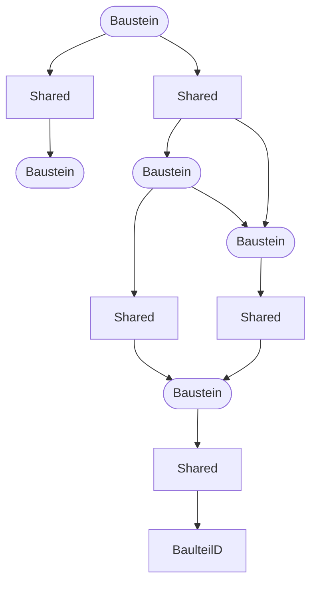

## Übersicht

Abgesehen vom klassischen Script-Konzept, bei dem Structs definiert, in der `init()`-Funktion erstellt werden und im jeweiligen `tick()` individuell angelegte Funktionen ausgeführt werden, gibt es für Lotus-Scripts auch eine Async/Await-Bibliothek. Darauf aufbauend haben
wir ein asynchrones Baukastenmodell entwickelt:

Hierzu werden in `init()` (und üblicherweise entsprechenden Unterfunktionen) Anweisungen aufgerufen, mit denen _Bausteine_ und _Shareds_ erstellt werden und dabei auch gleich definieren, wie sie miteinander verbunden werden. Jeder Baustein läuft dann während der Simulation automatisch, es bedarf keiner weiteren Aufrufe aus der die `tick()`-Funktion heraus. In der `tick()`-Funktion muss nur noch für das ganze Script einmalig `lotus_rt::tick();` aufgerufen werden.

## Allgemeines Schema

Die in `init()` aufgebauten und vernetzten Elemente könnte man sich dann folgendermaßen vorstellen:

Man muss sich das dann so vorstellen, dass die entsprechenden Werte im laufenden Betrieb entlang der Pfeile übertragen werden, wobei ein wichtiger Aspekt darin besteht, dass in den meisten Fällen sogar nur dann Werte übertragen und vor allem in der Folge nur dann weiter verarbeitet werden, wenn sie sich ändern, ohne dass man als Nutzer des Baukastens Extraaufwand betreiben muss.

## Shareds

Die Kommunikation zwischen den mit Funktionen definierten Bausteinen erfolgt mit Shareds. Ein Shared ist sowas wie ein "Behälter" für einen Status, der im laufenden Betrieb unterschiedliche Werte annehmen kann. So kann ein Shared beispielsweise den Zustand eines Tasters oder ein Drehmoment sein.

1. Normalerweise bleiben sie die ganze Lebenszeit des Scripts existent

2. Sie halten eine Variable, sie sind dabei generisch, man kann also neben den Standardtypen wie `i32`, `f32` usw. auch jeden beliebigen, ggf. selbst definierten Typ verwenden, solange dieser `Default` und `Clone` implementiert.

3. Sie können beliebig geklont werden! Trotzdem verfügen beide Klone immer noch über den*selben* Status.

4. Es wird verfolgt, wann sie geschrieben werden: Ein Großteil der Funktionen, gerade der einfachen wie `to_float()`, `or` usw., werden daher nur dann aktiv, wenn sich der Input-Shared verändert! Es handelt sich also nicht um Verbindungen, die ständig im Simstep abgearbeitet werden!

5. Shareds können ohne `mut` gebunden werden, weil sich der "Behälter" selbst ja nicht ändert, und sind somit sehr freizügig einsetzbar. Deshalb ist die Ownership von Rust auch kein Problem, da Shareds beliebig geklont werden können (also `foo.clone()`) und sie trotzdem weiterhin auf dieselbe (!) Variable verweisen.

Shareds können von Bausteinen sowohl gelesen als auch geschrieben werden – oder beides. Auch klassische Implementierungen, die über `tick()` heraus aufgerufen werden, können Shareds jederzeit schreiben oder lesen.

### Unsichtbare Shareds

Tatsächlich können viele Bausteine auch direkt miteinander verbunden werden. Hierzu kann hinter einen Shared-liefernden Baustein (z.B. Button) mit einem `.` getrennt ein Shared-erwartender Baustein (wie ein bool-float-Konverter) geschrieben werden.

## Bausteine

Bausteine definieren, wie die Werte in den Shareds verarbeitet werden. Erstellt werden sie ebenfalls aus `init()` heraus mit einer entsprechenden Funktion. Auch wenn es Abweichungen gibt, werden der Funktion meistens ein oder mehrere Shareds übergeben, die dann als Input fungieren (neben ggf. weiteren Eigenschaften), meistens zusammengefasst zu einem individuellen `struct`, und sie geben dann meistens einen Shared zurück, in den im Betrieb dann der Output geschrieben wird.

Auf den Baustein selbst hat man im laufenden Betrieb dann keinen Zugriff mehr, aber dies ist auch nicht nötig oder sinnvoll, auch wenn das erst einmal ungewöhnlich erscheint.

## Vorteile

- Durch die Shareds entfällt die Notwendigkeit, Workarounds für gemeinsam genutzte Zustände zu bauen, welche in der herkömmlichen Programmierung benötigt werden (globale Variablen).

- Die einzelnen Elemente werden in einem Schritt bei der Initialisierung erstellt, dabei sofort zusammengestöpselt und fangen an zu arbeiten, man muss sich nicht separat um den Aufbau der Variablen/Struct-Struktur und dann die korrekte Verarbeitung der Tick-Funktionen kümmern, was insbesondere die Wartung vereinfacht.

- Wenn man Builder verwendet (s.u.), dann können in fast allen Fällen ohne Code-Änderungen direkt Updates unseres Baukastens übernommen werden, auch wenn sich dabei größere Änderungen in den verwendeten Structs ergeben, insbesondere ändern sich keine Tick-Funktionen, weil diese gar nicht von außen aufgerufen werden

- Verzögerte oder zeitlich in Stufen (mit Pausen) ablaufende Vorgänge lassen sich wesentlich eleganter lösen. Bausteine können einfach einschlafen, ohne dass man komplizierte State-Variablen einführen muss und ohne dass das ganze Script anhält.

- Funktionen werden in den meisten Fällen nicht generell ständig abgearbeitet, sondern im Allgemeinen nur, wenn neue Werte übertragen werden; vor allem "vererbt" sich dieses Verhalten: Wenn sich am Anfang einer Kette keine Veränderung ergibt, dann brauchen alle nachfolgenden Funktionen nicht aufgerufen werden (Dies gilt aber nicht für alle Bausteine: Eine exponentielle Annäherung liefert z.B. einen sich ständig verändernden Output-Wert).

## Nachteile

Das hier präsentierte Prinzip ist gut für solche technischen Simulationen geeignet, aber es gibt sicherlich Fälle, die schneller "hinprogrammierter" sind, insbesondere wenn sie unabhängig vom restlichen System-"Netzwerk" sind, z.B. wenn Werte direkt aus einer öffentlichen Variable gelesen, umgerechnet und wieder in eine öffentliche Variable geschrieben werden, oder Messages direkt durchgeleitet werden sollen usw..

Es erfordert natürlich auch ein gewisses Umdenken...
