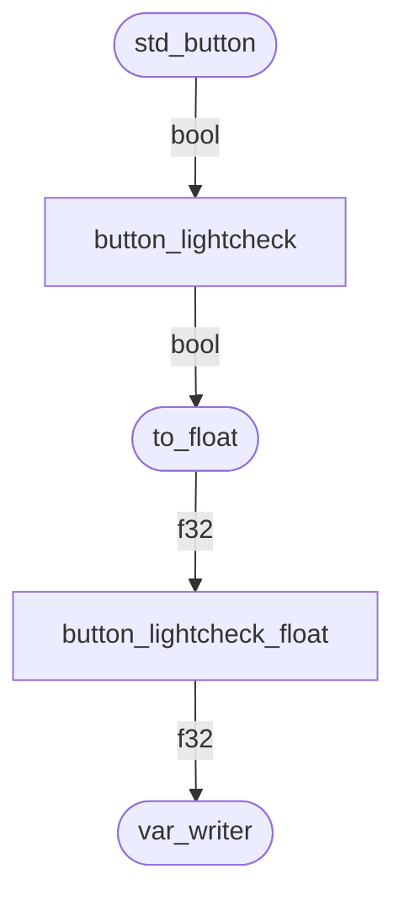

## Einstiegsbeispiel

Hinweis: Im Folgenden werden Builder verwendet. Hierzu bitte ggf. den folgenden Artikel lesen: [Builder](../../builder_d/)

### Schema

Am Besten gehen wir direkt rein mit einem Beispiel: Angenommen, ich habe eine Taste und solange ich die drücke, ist der Leuchtmelder "Fernlicht" an. Dann sieht das Ganze so aus:



### Implementierung

```rust
impl Script for TestScript {
    fn init(&mut self) {
        let button_lightcheck = std_button(
            ButtonProperties::builder()
                .input_event(InputEvent::new("Lightcheck", 0))
                .animation_var("A_CP_TS_LightCheck")
                .sound_on("Snd_CP_A_BtnDn")
                .sound_off("Snd_CP_A_BtnUp")
                .build(),
        );

        let button_lightcheck_float = button_lightcheck.to_float();

        button_lightcheck_float.var_writer("A_LM_FlashLight");

    }

    fn tick(&mut self) {
        lotus_rt::tick();
    }
}
```

### Erklärung

Hier ist nun folgendes passiert:

Der Aufbau der einzelnen Module erfolgt mittels Funktionen, die aus dem `init()` heraus aufgerufen werden.

`std_button()` erstellt einen Button und verwendet dafür die `ButtonProperties`. Hierbei handelt es sich um einen einfachen `struct`, der hier mit einem Builder erstellt wird, man könnte also statt dem `builder()…` auch einfach schreiben `ButtonProperties{input_event: … }`.
zu tun.

Die Rückgabe, also der Typ von `button_lightcheck` ist ein `Shared<bool>`. In der Simulation wird der Button also seinen boolischen Zustand in den Shared `button_lightcheck` schreiben.

In der nächsten Zeile wird an den `Shared<bool>` der Baustein `to_float()` angehängt, so dass im hier
neu definierten Shared `button_lightcheck_float` nun ein`f32` liegt, der entweder 0.0 oder 1.0 ist.

In der dritten Zeile wird mit `var_writer()` der Wert von `button_lightcheck_float` in eine Variable geschrieben.

Man beachte: Dieses Stück Code erstellt zum einen die Shareds und konfiguriert gleichzeitig den technischen Ablauf, mehr wird nicht benötigt.

### Vereinfachung`

Bis hierhin ist die Sache natürlich noch recht simpel. Da man, wie oben erwähnt, auch Bausteine direkt miteinander verbinden kann, lässt sich dieser Ablauf auch wie folgt vereinfachen:


```rust
    std_button(
        ButtonProperties::builder()
            .input_event("Lightcheck")
            .animation_var("A_CP_TS_LightCheck")
            .sound_on("Snd_CP_A_BtnDn")
            .sound_off("Snd_CP_A_BtnUp")
            .build(),
        )
        .to_float()
        .var_writer("A_LM_FlashLight");

```

ABER ACHTUNG: Das Verbinden von mehreren Bausteinen ist nur möglich, wenn der dazwischenliegende Wert nicht von anderer Seite erreichbar ist! Möchte man z.B. den Boolean vom Taster noch woanders verwenden, muss man wie oben den Taster erstmal per `let button_lightcheck = std_button(…)` in eine Variable schreiben.

## Es wird umfangreicher

Jetzt wollen wir einen Schalter fürs Fernlicht einbauen, zusätzlich gibt es einen Light-Test-Taster und man kann über einen Shared, der die Spannung darstellen soll, die Helligkeit der Kontrollleuchte justieren:


```rust
    let voltage_r = Shared::<f32>::new(1.0);

    let button_lightcheck =  std_button(
        ButtonProperties::builder()
            .input_event("Lightcheck")
            .animation_var("A_CP_TS_LightCheck")
            .sound_on("Snd_CP_A_BtnDn")
            .sound_off("Snd_CP_A_BtnUp")
            .build(),
    );

    switch(
            SwitchProperties::builder()
                .toggle_event("FlashLightToggle")
                .animation_var("A_CP_SW_FlashLight")
                .sound_switch("Snd_CP_A_Switch")
                .build(),
        )
        .or(&button_lightcheck)
        .to_float()
        .multiply(&voltage_r)
        .var_writer("A_LM_FlashLight");

```

Hier wird das Signal vom Switch genommen, dann wird die ODER-Operation zusammen mit einem anderen Shared, nämlich dem vom Lichttest, durchgeführt, dann in einen `f32` zwischen 0.0 und 1.0 umgewandelt, mit der Spannung multipliziert und schließlich in eine Variable geschrieben.

Alternativ könnte man den Ablauf auch wie folgt bauen:


```rust
    …

    let flashlight_switch = switch(
            SwitchProperties::builder()
                .toggle_event("FlashLightToggle")
                .animation_var("A_CP_SW_FlashLight")
                .sound_switch("Snd_CP_A_Switch")
                .build(),
        );

    flashlight_switch.or(&button_lightcheck)
        .to_float()
        .multiply(&voltage_r)
        .var_writer("A_LM_FlashLight");

```

So kann man beispielsweise den Schalterzustand separat abgreifen und an anderer Stelle weiter verwenden.
