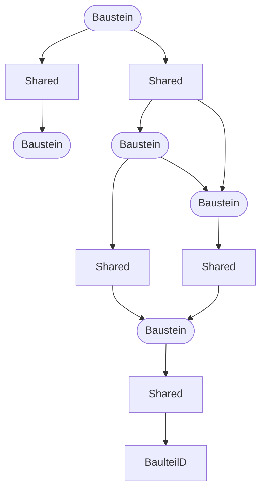
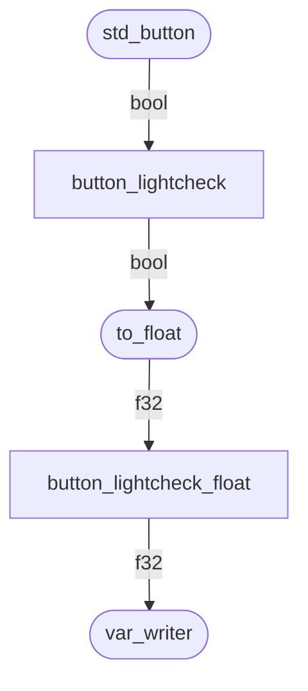
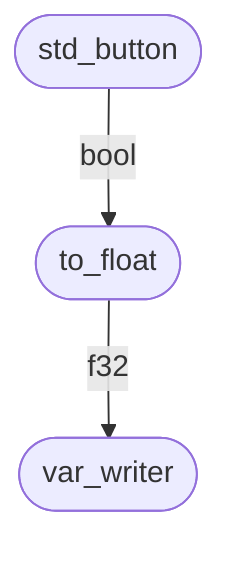
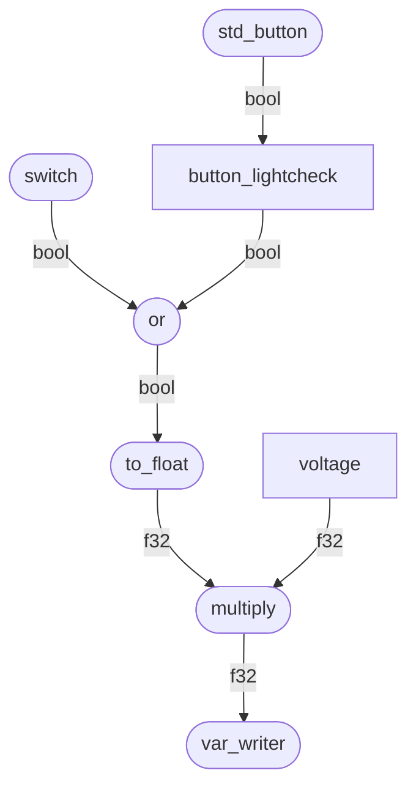
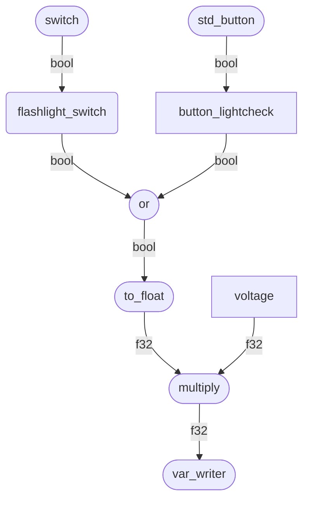

## Einleitung

Der Hauptteil dieser Dokumentation erklärt den Umgang mit dem RT-Extra-Baukasten. Einen ganz kleinen Einblick in die dahinter liegende Technik gebe ich am Ende dieses Artikels.

### Übersicht

Abgesehen vom klassischen Script-Konzept, bei dem Structs definiert, in der `init()`-Funktion erstellt werden und im jeweiligen `tick()` individuell angelegte Funktionen ausgeführt werden, gibt es für Lotus-Scripts auch eine Async/Await-Bibliothek. Darauf aufbauend haben
wir ein asynchrones Baukastenmodell entwickelt:

Hierzu werden in `init()` Anweisungen (in Form von Funktionen) aufgerufen, mit denen die verschiedenen Bausteine erstellt werden und dabei auch gleich definiert, wie sie miteinander verkabelt werden. Jeder Baustein läuft dann von alleine für sich, es muss nichts mehr in die `tick()`-Funktion eingebaut werden.

### Vorteile

- Durch die Shareds entfällt die Notwendigkeit, Workarounds für gemeinsam genutzte Zustände zu bauen, welche in der herkömmlichen Programmierung benötigt werden (globale Variablen).

- Die einzelnen Elemente werden in einem Schritt bei der Initialisierung erstellt, dabei sofort zusammengestöpselt und fangen an zu arbeiten, man muss sich nicht separat um den Aufbau der Variablen/Struct-Struktur und dann die korrekte Verarbeitung der Tick-Funktionen kümmern, was insbesondere die Wartung vereinfacht.

- Wenn man Builder verwendet (s.u.), dann können in fast allen Fällen ohne Code-Änderungen direkt Updates unseres Baukastens übernommen werden, auch wenn sich dabei größere Änderungen in den verwendeten Structs ergeben, insbesondere ändern sich keine Tick-Funktionen, weil diese gar nicht von außen aufgerufen werden

- Verzögerte oder zeitlich in Stufen (mit Pausen) ablaufende Vorgänge lassen sich wesentlich eleganter lösen. Bausteine können einfach einschlafen, ohne dass man komplizierte State-Variablen einführen muss und ohne dass das ganze Script anhält.

- Funktionen werden in den meisten Fällen nicht generell ständig abgearbeitet, sondern im Allgemeinen nur, wenn neue Werte übertragen werden; vor allem "vererbt" sich dieses Verhalten: Wenn sich am Anfang einer Kette keine Veränderung ergibt, dann brauchen alle nachfolgenden Funktionen nicht aufgerufen werden (Dies gilt aber nicht für alle Bausteine: Eine exponentielle Annäherung liefert z.B. einen sich ständig verändernden Output-Wert).

### Shareds

Die Kommunikation zwischen den mit Funktionen definierten Bausteinen erfolgt mit Shareds. Ein Shared ist sowas wie eine Status-Variable, die im laufenden Betrieb unterschiedliche Werte annehmen kann. So kann ein Shared beispielsweise den Zustand eines Tasters oder ein Drehmoment sein.

1. Normalerweise bleiben sie die ganze Lebenszeit des Scripts existent

2. Sie halten eine Variable, sie sind dabei generisch, man kann also neben den Standardtypen wie `i32`, `f32` usw. auch jeden beliebigen, ggf. selbst definierten Typ verwenden, solange dieser Default und Clone implementiert.

3. Sie können beliebig geklont werden, trotzdem lesen und speichern beide Klone immer noch über denselben Speicherbereich.

4. Es wird verfolgt, wann sie geschrieben werden: Ein Großteil der Funktionen, gerade der einfachen wie `to_float()`, `or` usw., werden daher nur dann aktiv, wenn sich der Input-Shared verändert! Es handelt sich also nicht um Verbindungen, die ständig im Simstep abgearbeitet werden!

5. Shareds können ohne `mut` gebunden werden, weil der innere Zustand intern mutabel verwaltet wird, und sind somit sehr freizügig einsetzbar. Auch die Ownership von Rust ist kein Problem, da Shareds beliebig geklont werden können (also `foo.clone()`) und sie trotzdem weiterhin auf dieselbe (!) Variable verweisen.

Shareds können von Bausteinen sowohl gelesen als auch geschrieben werden – oder beides. Aber auch aus eigenen Funktionen, auch wenn diese aus `tick()` heraus aufgerufen werden, können Shareds jederzeit schreiben oder lesen.

### Unsichtbare Shareds

Tatsächlich können viele Bausteine auch direkt miteinander verbunden werden. Hierzu kann hinter einen Shared-liefernden Baustein (z.B. Button) mit einem `.` getrennt ein Shared-erwartender Baustein (wie ein bool-float-Konverter) geschrieben werden.

### Allgemeines Schema



## Einschub: Builder

Um die Beispiele und den Code zu verstehen, müssen vorher die Builder verstanden werden. Auch wenn es auf den ersten Blick aufwendiger aussieht, so sind sie durchaus sehr praktisch.

Angenommen, wir haben folgenden Struct und folgende Funktion:

```rust
#[derive(Builder)]
struct PropertiesABC {
  param_a: f32,
  param_b: i16,
  param_c: i32,
}

fn init_function(a: PropertiesABC){
    …
}
```

Dann sieht der zugehörige Funktionsaufruf meistens so aus:

```rust
init_function( PropertiesABC{param_a: 1.0, param_b: 42, param_c: 411});
```

Da der Struct mit dem Builder-Derive ausgestattet ist, funktioniert auch dieser Aufruf:

```rust
init_function(
    PropertiesABC::builder()
        .param_a(1.0)
        .param_b(42)
        .param_c(411)
        .build(),
)
```

So weit, so kompliziert… ;-)

Jetzt wird es aber interessant: Wenn die Felder `param_b` und `param_c` Options sind, dann kann man sie einfach weglassen:

```rust
#[derive(Builder)]
struct PropertiesABC {
  param_a: f32,
  param_b: Option<i16>,
  param_c: Option<i32>,
}

// Klassischer Aufruf:
init_function( PropertiesABC{param_a: 1.0, param_b: None, param_c: None});

// Aufruf mit Builder
init_function(
    PropertiesABC::builder()
        .param_a(1.0)
        .build(),
)
```

Das ist besonders praktisch bei Structs mit vielen optionalen Feldern.

Auch der Umgang mit Strings und Vektoren wird damit eleganter:

```rust
#[derive(Builder)]
struct PropertiesABC {
    #[builder(into)]
    param_a: String,
}

// Klassischer Aufruf - an den String muss noch 'to_string()'
// angehängt werden ==> schlechtere Lesbarkeit
init_function( PropertiesABC{param_a: "foo".to_string());

// Aufruf mit Builder
init_function(
    PropertiesABC::builder()
        .param_a("foo")
        .build(),
)
```

Und das Beste: Wenn wir in unsere Bibliothek nachträglich ein viertes Feld hinzufügen, dann muss Dein Code in keiner Weise angepasst werden (sofern das Feld ein Option<> ist oder Default implementiert):

```rust
#[derive(Builder)]
struct PropertiesABC {
  param_a: f32,
  param_b: Option<i16>,
  param_c: Option<i32>,
  new_param: Option<f64>
}

// Klassischer Aufruf: FEHLERHAFT, new_param fehlt!
init_function( PropertiesABC{param_a: 1.0, param_b: None, param_c: None});

// Aufruf mit Builder: Weiterhin korrekt
init_function(
    PropertiesABC::builder()
        .param_a(1.0)
        .build(),
)
```

## Einstiegsbeispiel

### Schema

Am Besten gehen wir direkt rein mit einem Beispiel: Angenommen, ich habe eine Taste und solange ich die drücke, ist der Leuchtmelder "Fernlicht" an. Dann sieht das Ganze so aus:



### Implementierung

```rust
impl Script for TestScript {
    fn init(&mut self) {
        let button_lightcheck = std_button(
            ButtonProperties::builder()
                .input_event(InputEvent::new("Lightcheck", 0))
                .animation_var("A_CP_TS_LightCheck")
                .sound_on("Snd_CP_A_BtnDn")
                .sound_off("Snd_CP_A_BtnUp")
                .build(),
        );

        let button_lightcheck_float = button_lightcheck.to_float();

        button_lightcheck_float.var_writer("A_LM_FlashLight");

    }

    fn tick(&mut self) {
        lotus_rt::tick();
    }
}
```

### Erklärung

Hier ist nun folgendes passiert:

Der Aufbau der einzelnen Module erfolgt mittels Funktionen, die aus dem `init()` heraus aufgerufen werden.

`std_button()` erstellt einen Button und verwendet dafür die `ButtonProperties`. Hierbei handelt es sich um einen einfachen `struct`, der hier mit einem Builder erstellt wird, man könnte also statt dem `builder()…` auch einfach schreiben `ButtonProperties{input_event: … }`.
zu tun.

Die Rückgabe, also der Typ von `button_lightcheck` ist ein `Shared<bool>`. In der Simulation wird der Button also seinen boolischen Zustand in den Shared `button_lightcheck` schreiben.

In der nächsten Zeile wird an den `Shared<bool>` der Baustein `to_float()` angehängt, so dass im hier
neu definierten Shared `button_lightcheck_float` nun ein`f32` liegt, der entweder 0.0 oder 1.0 ist.

In der dritten Zeile wird mit `var_writer()` der Wert von `button_lightcheck_float` in eine Variable geschrieben.

Man beachte: Dieses Stück Code erstellt zum einen die Shareds und konfiguriert gleichzeitig den technischen Ablauf, mehr wird nicht benötigt.

### Vereinfachung`

Bis hierhin ist die Sache natürlich noch recht simpel. Da man, wie oben erwähnt, auch Bausteine direkt miteinander verbinden kann, lässt sich dieser Ablauf auch wie folgt vereinfachen:



```rust
    std_button(
        ButtonProperties::builder()
            .input_event("Lightcheck")
            .animation_var("A_CP_TS_LightCheck")
            .sound_on("Snd_CP_A_BtnDn")
            .sound_off("Snd_CP_A_BtnUp")
            .build(),
        )
        .to_float()
        .var_writer("A_LM_FlashLight");

```

ABER ACHTUNG: Das Verbinden von mehreren Bausteinen ist nur möglich, wenn der dazwischenliegende Wert nicht von anderer Seite erreichbar ist! Möchte man z.B. den Boolean vom Taster noch woanders verwenden, muss man wie oben den Taster erstmal per `let button_lightcheck = std_button(…)` in eine Variable schreiben.

## Es wird umfangreicher

Jetzt wollen wir einen Schalter fürs Fernlicht einbauen, zusätzlich gibt es einen Light-Test-Taster und man kann über einen Shared, der die Spannung darstellen soll, die Helligkeit der Kontrollleuchte justieren:



```rust
    let voltage_r = Shared::<f32>::new(1.0);

    let button_lightcheck =  std_button(
        ButtonProperties::builder()
            .input_event("Lightcheck")
            .animation_var("A_CP_TS_LightCheck")
            .sound_on("Snd_CP_A_BtnDn")
            .sound_off("Snd_CP_A_BtnUp")
            .build(),
    );

    switch(
            SwitchProperties::builder()
                .toggle_event("FlashLightToggle")
                .animation_var("A_CP_SW_FlashLight")
                .sound_switch("Snd_CP_A_Switch")
                .build(),
        )
        .or(&button_lightcheck)
        .to_float()
        .multiply(&voltage_r)
        .var_writer("A_LM_FlashLight");

```

Hier wird das Signal vom Switch genommen, dann wird die ODER-Operation zusammen mit einem anderen Shared, nämlich dem vom Lichttest, durchgeführt, dann in einen `f32` zwischen 0.0 und 1.0 umgewandelt, mit der Spannung multipliziert und schließlich in eine Variable geschrieben.

Alternativ könnte man den Ablauf auch wie folgt bauen:



```rust
    …

    let flashlight_switch = switch(
            SwitchProperties::builder()
                .toggle_event("FlashLightToggle")
                .animation_var("A_CP_SW_FlashLight")
                .sound_switch("Snd_CP_A_Switch")
                .build(),
        );

    flashlight_switch.or(&button_lightcheck)
        .to_float()
        .multiply(&voltage_r)
        .var_writer("A_LM_FlashLight");

```

So kann man beispielsweise den Schalterzustand separat abgreifen und an anderer Stelle weiter verwenden.

## Gesamt-Aufbau

Bisher haben wir uns nur darum gekümmert, Bausteine innerhalb von Funktionen zu "verkabeln".
Üblicherweise möchte man die verschiedenen Bausteine auf verschiedene Dateien/Module aufteilen, statt dass eine einzelne Funktion
das gesamte Fahrzeugscript zusammenbaut.

Daher möchte ich hier kurz anreißen, wie ich meine Fahrzeugscripts aufbaue, weil ich es so einfach, aber auch schön
und übersichtlich finde.

### Ein bestimmtes Modul

Nehmen wir als Beispiel das Cockpit-Modul. Hier verhält es sich so, dass die meisten Taster und Leuchtmelder von extern gelesen/geschrieben werden müssen. Ausnahme ist z.B. der Lichttest, der muss von außen nicht abgefragt werden. Dementsprechend wird ein passendes struct angelegt:

```rust
pub struct Cockpit {
    light: Shared<bool>,
    doors: Shared<bool>,
    …
}
```

Für's Erstellen und Verkabeln der Bausteine verwenden wir einfach die Funktion `default()` der Default-Implementierung, die automatisch
aufgerufen wird. Für das Erstellen der Bausteine, die nach außen hin les-/schreibbar sein sollen, gibt es dann zwei verschiedene Varianten, die auch gemischt angewendet werden können:

Entweder lässt man den Baustein per `let` einer lokalen Variable zuweisen und überträgt diese dann (siehe im Beispiel `light`), oder man erstellt den Baustein direkt im struct (siehe im Beispiel `doors`). Der Lightcheck-Button wird dagegen nur lokal gespeichert.

```rust
impl Default for Cockpit {
    fn default() -> Self {
        let light_check = std_button(…);

        let light = std_button(…);

        Self{
            // da der Name der lokalen Variable mit dem des Structs
            // identisch ist, geht auch die vereinfachte Version "light,":
            light: light,

            doors: std_button(…),
        }
    }
}
```

Als nächstes brauchen wir ein Parent-Modul welches die verschiedenen Modulen verbindet, der Name könnte z.B. system_interface lauten. Hierbei übernimmt es auch die Rolle des technischen
Transfers: Der Richtungwender, Sollwertgeber und Türschalter liefern ja erstmal nur rohe Werte, wohingegen die Traktion und die
Türsteuerungen konkret aufbereitete Werte benötigen. Die Zusammenführung und Verarbeitung übernimmt nun dieses Modul. Gleichzeitig definiert es auch das Struct mit den jeweiligen Untermodulen.

Letzteres sieht dann z.B. so aus:

```rust
#[derive(Clone)]
pub struct Systems {
    pub cockpit: Cockpit,
    pub power: Power,
    pub traction: Traction,
    pub brakes: Brakes,
    pub flaps_and_co: FlapsAndCo,
    …
}
```

Um die einzelnen Module zu erstellen, aber auch untereinander zu verkabeln, wird wieder ein Default implementiert. Die Verkabelungen kann man schön in einzelne Unterfunktionen aufteilen, die man wiederum als Methoden von `Systems` definiert:

```rust
impl Default for Systems {
    fn default() -> Self {
        let interface = Self {
            cockpit: CockpitState::default(),
            power: Power::default(),
            traction: Traction::default(),
            brakes: Brakes::default(),
            flaps_and_co: FlapsAndCo::default(),
            …
        };

        interface.general_stuff();

        interface.power_stuff();

        …

        interface
    }
}

impl Systems {
    fn general_stuff(&self) {
        Shared::<f32>::var_reader("v_Axle_mps_0_0").var_writer("v_Axle_mps_0_0_abs");

        Shared::<f32>::var_reader("v_Axle_mps_0_1")
            .var_writer("Tacho_Speed_MPS")
            .forward(&self.cockpit.tacho);

        self.cockpit
            .fahrtwender_state
            .not_equal_const(FahrtwenderState::Neutral)
            .forward(&self.fahrtwender_on);

        self.cockpit
            .token_fahrtwender
            .equal_const(Some(TokenFahrtwender::Hinten))
            .forward(&self.flaps_and_co.fahrtwender_set_back);
    }

    fn interface.power_stuff(&self) {
        …
    }

    …
}

```

Schließlich muss nur noch `Systems` als Feld des Scripts hinzugefügt werden und das Script-Struct mit der Default-Derive ausgestattet sein:

```rust
#[derive(Default)]
pub struct ScriptV6e {
    systems: Systems;
}
```

Das Default-Derive sorgt dann automatisch dafür, dass `systems` mit dessen Default-Implementierung initialisiert wird, worüber wiederum die einzelnen Untermodule initialisiert und verkabelt werden.

## Weitere nette Vereinfachungen

### Ähnliche Bausteine

Ein klassisches Beispiel sind Dashboards mit vielen baugleichen Tastern. Da bestimmte Parameter beim Zusammenbau im Falle dieses Dashboards
immer gleich sind, kann man hierfür eine eigene Funktion anlegen, die dann einerseits nur die variierenden Parameter (Animation und Event) benötigt und andererseits selbst ohne Builder aufgerufen werden kann, ohne dass man die Vorteile desselben verliert:

```rust
  fn default() -> Self {
    fn gt6n_button(input_event: &str, animation_var: &str) -> Shared<bool>{
        std_button(
            ButtonProperties::builder()
                .input_event(InputEvent::new(input_event, 0))
                .animation_var(animation_var)
                .sound_on("Snd_CP_A_BtnDn")
                .sound_off("Snd_CP_A_BtnUp")
                .build(),
        )
    }

    …
    light = gt6n_button("Light_Toggle", "switch_light_pos");
    heater = gt6n_button("Heater_OnOff", "switch_heater_pos");
    …
  }
```

## Eigene Bausteine erstellen

Selbstverständlich ist es auch möglich, Funktionen zu bauen, die als eigene Bausteine arbeiten. Hierfür gibt es mehrere Möglichkeiten, die auch kombiniert werden können.

### Process

Das ist sicherlich die einfachste Variante, ein individuelles Verhalten zu bauen: Unter Verwendung des Bausteins `process`. Dieses Element ist generisch, das heißt es kann an jeden beliebigen Baustein oder jedes beliebige Shared angehängt werden. Man übergibt ihm dann eine normale Funktion oder eine Closure (eine spezielle Art von Funktion, die direkt "vor Ort" erstellt wird), die dann entsprechend ausgeführt wird, wenn ein neuer Eingangswert kommt:

```rust
    let a = std_button(…).process(|f| if f {3} else {5});
```

In diesem Beispiel wird, sobald der Button gedrückt oder losgelassen wird, die Funktion in der Klammer durchgeführt und der Wert im Shared a gespeichert. Dementsprechend nimmt a den Wert 3 an, wenn die Taste gedrückt wird, und 5, wenn sie losgelassen wird.

### Aus bestehenden Shareds und Bausteinen

Natürlich kann man auch eigene Bausteine als eigene Funktionen definieren. Meine Beispiele sind nicht generisch und keine Methoden, damit es nicht zu kompliziert wird. Aber dahingehend kann man sich natürlich ebenfalls austoben!

```rust
fn neue_funktion(a: Shared<bool>, b: Shared<bool>) -> Shared<float>{
    a.invert().or(&b).to_float()
}
```

Sobald sich a oder b verändern, wird a invertiert und mit b ODER-operiert, anschließend in einen `f32` umgewandelt.

### Mit on_refresh oder on_actually_change

```rust

fn weitere_funktion(a: Shared<f32>, b: f32) -> Shared<f32>{
    let output = Shared::<f32>::default();

    a.on_refresh(move |v| output.set(*v + b));

    output
}

```

Wir bewegen uns nun in Gefilde, in denen zunehmend das Ownership-Management von Rust interessant wird, aber diese Pandora-Büchse wollen wir an dieser Stelle mal geschlossen lassen, daher nur zusammengefasst:

Zunächst wird ein neues Shared definiert, welches am Ende der Funktion als Return übergeben wird. Die Funktion, die `a.on_refresh` übergeben wird, wird immer dann aufgerufen, wenn in `a` an anderer Stelle geschrieben wird (egal, ob der Wert mit dem alten Wert identisch ist, oder nicht). In dieser Funktion (in diesem Fall Closure) wird der Wert, den `a` zu jenem Zeitpunkt hat, als `v` übergeben. Der Wert wird genommen, mit dem zweiten Funktionsparameter `b` addiert und in das Output-Shared geschrieben. Wenn `a` nicht beschrieben wird, wird auch der Output nicht geschrieben.

Ein etwas anderes Verhalten zeigt `on_actually_change`:

```rust

fn noch_eine_funktion(a: Shared<f32>, b: f32) -> Shared<f32>{
    let output = Shared::<f32>::default();

    a.on_actually_change(move |v| output.set(*v + b));

    output
}

```

Hier wird die Closure nur dann aufgerufen, wenn sich der Wert von `a` auch wirklich **verändert** hat! Das ist vor allem dann interessant,
wenn zu erwarten ist dass `a` ständig geschrieben wird (z.B. bei exponentieller Näherung).

### Mit eigener Loop

Und schließlich gibt es noch die ganz "rohe" Variante – mit einem eigenen Loop. Wie dieser genau arbeitet, hängt dann natürlich
vom Anwendungsfall ab: Es können Loops sein, die in jedem Berechnungsschritt durchlaufen werden, oder welche, die auf verschiedene
Dinge warten, sei es das Setzen eines Shareds oder einem Tastendruck – oder einfach dem Ablauf eines Zeitintervalls. Als einfaches Beispiel
sei hier `exponential_approach` gezeigt:

```rust
pub fn exponential_approach(&self, exponent: f32) -> Shared<f32> {
    let state = Shared::<f32>::default();

    {
        let state = state.clone();
        let target = self.clone();

        spawn(async move {
            loop {
                state.set(exponential_approach(state.get(), exponent, target.get()));
                wait::next_tick().await;
            }
        });
    }

    state
}
```

Zunächst wird ein Output erstellt (`state`) und ein Klon erstellt, da das "Original" am Ende als Rückgabewert übergeben wird. Auch von `self` wird ein Klon erstellt. Die Klone benötigt man, da diese per `move` an die asynchrone Funktion übergeben werden.

Der Aufruf von `spawn` ruft die "innere" Funktion auf (in diesem Fall eine Closure); das Besondere ist aber, dass diese Funktion _asynchron_ zu laufen beginnt, d.h. die äußere Funktion wartet nicht auf die innere Funktion, sondern läuft unmittelbar weiter. Das bedeutet auch, dass die innere Funktion beliebig lange laufen kann, ohne dass das restliche Script oder gar Programm einfriert.

Genau diese Eigenschaft nutzen wir hier aus: Die asynchron gestartete Funktion ist hier nämlich eine Endlosschleife, in der der Wert von `state`genommen wird, durch die mathematische Funktion `exponential_approach` geleitet wird, und schließlich in das `target` geschrieben wird. Anschließend _muss_ irgendein wait:: aufgerufen werden, andernfalls würde die Schleife nämlich dann _doch_ alles aufhalten. In diesem
Fall wird einfach das nächste Tick abgewartet.

Abschließend sei noch erwähnt, dass asynchron aufgerufene Funktionen natürlich _nicht_ endlos laufen müssen. Wenn man Mikroprozessoren aller Art simulieren möchte, könnte man z.B. eine Einstiegsfunktion asynchron aufrufen, die dann wiederum irgendeinen Bildschirm rendert, dann zwei
Sekunden wartet (z.B.mit `wait::seconds(1.0).await()`), dann einen anderen Bildschirm zeigt und dann auf eine User-Eingabe wartet. Sobald diese erfolgt, könnten wiederum nach einer Verzögerung verschiedene asynchrone Funktionen aufgerufen werden – je nach Eingabe – und die Funktion enden. Da dies alles asynchron stattfindet, wird zu keinem Zeitpunkt irgendein anderer Simulator-/Script-Ablauf gestört.

## Und was ist mit der Thread-Safety???

Hier braucht man sich keine Sorgen machen: Auch wenn _scheinbar_ mehrere Funktionen gleichzeitig laufen, so kann man sich sicher sein, dass
innerhalb (!) eines Scripts keine verschiedenen Stücke Code tatsächlich gleichzeitig laufen. Technisch läuft ein bestimmtes Script stets auf einem einzigen Thread, die verschiedenen zueinander asynchronen Funktionen laufen hintereinander ab. In welcher Reihenfolge diese abgearbeitet werden, lässt sich jedoch nicht vorhersagen!
